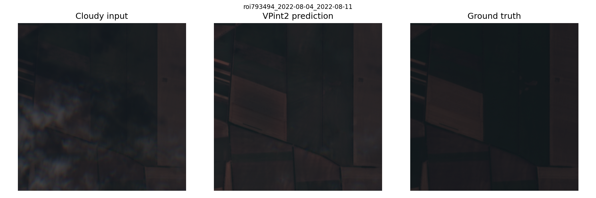

# allclear-benchmark

Benchmark for evaluating cloud removal models on the [AllClear](https://github.com/Zhou-Hangyu/allclear) dataset.
Implements VPint2 as a baseline, evaluated on a filtered subset of the AllClear test set.

## Requirements

Requires [uv](https://docs.astral.sh/uv/getting-started/installation/). Run all commands from the repo root.

```bash
# VPint2, LeastCloudy, Mosaicing
uv venv .venv --python 3.13
source .venv/bin/activate
uv pip install -r requirements.txt

# EMRDM
uv venv emrdm --python 3.10
source emrdm/bin/activate
uv pip install "setuptools==69.5.1"
uv pip install -r requirements_emrdm.txt

# UnCRtainTS
uv venv uncrtaints --python 3.13
source uncrtaints/bin/activate
uv pip install -r requirements_uncrtaints.txt
```

No environment activation is needed after this - use `run.py` for all models.

## Setup

Filters the AllClear test set to a subset compatible with VPint2's input requirements. See docs/methodology.md for the filtering criteria.

Run from the repo root:

```bash
bash setup/setup.sh
```

This will:

1. Download AllClear metadata (dataset JSONs + cloud/shadow CSVs)
2. Filter the test set to VPint2-eligible samples → `setup/vpint2_pairs.json`, `setup/vpint2_dataset.json`
3. Download the image data (TIFFs) for the eligible ROIs

Thresholds used for filtering can be configured at the top of `setup/setup.sh`.

## Run benchmark

**Quick test (single ROI):**

```bash
python run.py --model-name LeastCloudy --selected-rois roi110646

python run.py --model-name Mosaicing --selected-rois roi110646

python run.py --model-name VPint2 --vpint2-pairs-fpath setup/vpint2_pairs.json --selected-rois roi110646 --batch-size 1

python run.py --model-name UnCRtainTS --uncrtaints-weight-folder . --uncrtaints-experiment-name diagonal_1 --aux-sensors s1 --selected-rois roi110646

python run.py --model-name EMRDM --emrdm-config-fpath models/EMRDM/configs/example_training/sentinel.yaml --emrdm-ckpt-fpath models/EMRDM/checkpoints/sen12mscr.ckpt --aux-sensors s1 --selected-rois roi110646
```

**Full benchmark:**

```bash
python run.py --model-name LeastCloudy --batch-size 4

python run.py --model-name Mosaicing --batch-size 4

python run.py --model-name VPint2 --vpint2-pairs-fpath setup/vpint2_pairs.json --batch-size 1

python run.py --model-name UnCRtainTS --uncrtaints-weight-folder . --uncrtaints-experiment-name diagonal_1 --aux-sensors s1 --batch-size 8

python run.py --model-name EMRDM --emrdm-config-fpath models/EMRDM/configs/example_training/sentinel.yaml --emrdm-ckpt-fpath models/EMRDM/checkpoints/sen12mscr.ckpt --aux-sensors s1 --batch-size 1
```

## Visualise predictions (VPint2)

```bash
python visualise.py --roi <roi>
```

Output saved to `pred_vs_target/<roi_id>.png`.

Example output: 

## Visualise all ROIs on a map

A small helper script is provided to generate a GeoJSON file from the filtered VPint2-compatible dataset used in this benchmark, which can be visualised using a map tool like https://geojson.io/next.

```bash
python setup/make_geojson.py
```

## Attribution

- Dataset, data loading, and model wrappers (`dataset.py`, `download.py`, `model_wrappers.py`) based on [AllClear](https://github.com/Zhou-Hangyu/allclear) (MIT License)
- VPint2: [ADA-research/VPint2](https://github.com/ADA-research/VPint2)
- EMRDM: [Ly403/EMRDM](https://github.com/Ly403/EMRDM)
- UnCRtainTS: [PatrickTUM/UnCRtainTS](https://github.com/PatrickTUM/UnCRtainTS)
