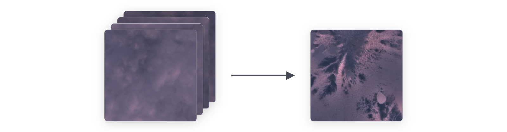
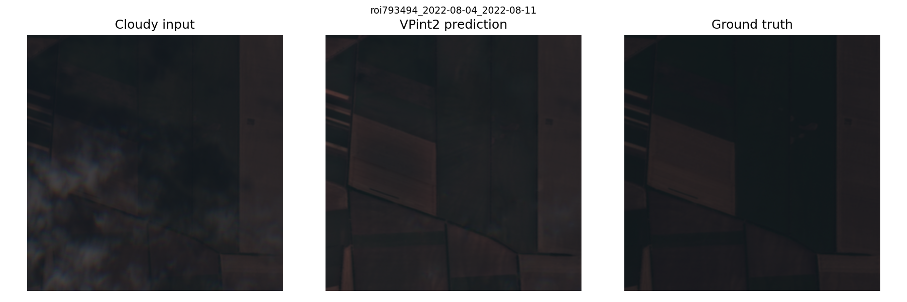

# allclear-benchmark

Codebase for the thesis **Evaluation of Classical, Generative, and Multi-Temporal Methods
for Sentinel-2 Cloud Removal: Impacts on Reconstruction Quality and Spectral Index
Preservation**.



Five methods are compared on the same 366 scenes from the
[AllClear](https://github.com/Zhou-Hangyu/allclear) dataset: two baselines (LeastCloudy,
Mosaicing), one interpolation method (VPint2), and two deep learning models (UnCRtainTS, EMRDM).

## What you need

- Docker with Compose, and an NVIDIA GPU for UnCRtainTS and EMRDM
- ~65 GB free disk for the AllClear imagery
- Several hours for the download

Everything runs in containers; nothing is installed on the host.

## 1. Clone

```bash
git clone --recurse-submodules https://github.com/jesslyw/allclear-benchmark.git
cd allclear-benchmark
```

If you already cloned without the flag:

```bash
git submodule update --init --recursive
```

## 2. Download model checkpoints

LeastCloudy, Mosaicing and VPint2 need no checkpoints. The two deep learning models do.
First create EMRDM's checkpoint directory:

```bash
mkdir -p models/EMRDM/checkpoints
```

Then download the respective checkpoints and place them (using a tool like rsync) in the target directories specified in the table below.

| Model      | Download from                                                                                                                                                                                                                                                            | Place at                                                                                                                        |
| ---------- | ------------------------------------------------------------------------------------------------------------------------------------------------------------------------------------------------------------------------------------------------------------------------ | ------------------------------------------------------------------------------------------------------------------------------- |
| EMRDM      | [Google Drive](https://drive.google.com/drive/folders/1T3OwRNP5r5qVLQZujnl2WDBVXHC1Am65?usp=sharing) (also [Aliyun](https://www.alipan.com/s/39BcJezgsBC) / [Baidu](https://pan.baidu.com/s/1RqYgluNNcYKXOa33kQioMQ), code `6161`) — `train/sentinel/last.ckpt` (597 MB) | `models/EMRDM/checkpoints/last.ckpt`                                                                                            |
| UnCRtainTS | [pCloud](https://u.pcloud.link/publink/show?code=kZsdbk0Z5Y2Y2UEm48XLwOvwSVlL8R2L3daV) — the `diagonal_1` folder (7 MB)                                                                                                                                                  | `models/UnCRtainTS/` — keep the folder intact, so that `models/UnCRtainTS/diagonal_1/` contains `conf.json` and `model.pth.tar` |

## 3. Setup: download and filter the data

```bash
docker compose run --rm setup
```

The download could take up to several hours. If you are on SSH, run it inside `tmux` so a dropped
connection does not interrupt it:

```bash
tmux new -s setup
docker compose run --rm setup
```

(Rerunning setup is safe and skips any ROIs already on disk.)

This filters the AllClear test set down to the scenes VPint2 and EMRDM can run on, then
downloads only those. The other three models have no such requirements, and are evaluated
on the same scenes so the results are comparable.

1. Download AllClear metadata
2. Screen for VPint2-eligible and EMRDM-eligible ROIs (metadata only, no imagery)
3. Download the imagery for the intersection of both lists
4. Re-run both filters against the downloaded cloud/shadow masks
5. Intersect the results → `setup/intersection_samples.json` (366 scenes)

## 4. Run the benchmark

One command per model:

```bash
docker compose run --rm -e MODEL=LeastCloudy cpu
docker compose run --rm -e MODEL=Mosaicing   cpu
docker compose run --rm vpint2
docker compose run --rm uncrtaints
docker compose run --rm emrdm
```

Each writes to `outputs/AllClear/intersection_samples/`:

- `<Model>_aggregated_metrics.csv` — one row, the headline numbers
- `<Model>_metadata.csv` — per-scene metrics
- `<Model>_lulc_metrics.csv` — metrics broken down by land cover
- `<Model>_predictions.pt` — the predicted images

Models are independent, so a failed one can be rerun on its own.

> EMRDM is a diffusion model and samples stochastically, so its metrics vary slightly
> between runs.

## 5. Produce the thesis figures and tables

```bash
docker compose run --rm cpu -c \
  "jupyter nbconvert --to notebook --execute --inplace analysis/notebooks/thesis_artifact_analysis.ipynb"
```

Writes to `outputs/thesis/plots/` and `outputs/thesis/tables/`. The notebook reads the
CSVs and prediction tensors from step 4 and regenerates every figure and table in the thesis.

## Metrics

Standard cloud removal metrics:

| Metric | Description                   |
| ------ | ----------------------------- |
| MAE    | Mean absolute pixel error     |
| RMSE   | Root mean squared pixel error |
| PSNR   | Peak signal-to-noise ratio    |
| SAM    | Spectral angle mapper         |
| SSIM   | Structural similarity         |

Downstream application metrics:

| Metric   | Description                                                                                                                             |
| -------- | --------------------------------------------------------------------------------------------------------------------------------------- |
| NDVI-MAE | Error in [Normalized Difference Vegetation Index](https://www.usgs.gov/landsat-missions/landsat-normalized-difference-vegetation-index) |
| NBR-MAE  | Error in [Normalized Burn Ratio](https://www.usgs.gov/landsat-missions/landsat-normalized-burn-ratio)                                   |

Inference time per scene is recorded as `ms_per_sample` in the aggregated metrics.

## Models

| Model       | Type                  | Paper                                                                                                                                                                                                     | Repository                                                        |
| ----------- | --------------------- | --------------------------------------------------------------------------------------------------------------------------------------------------------------------------------------------------------- | ----------------------------------------------------------------- |
| LeastCloudy | Baseline              | —                                                                                                                                                                                                         | —                                                                 |
| Mosaicing   | Baseline              | —                                                                                                                                                                                                         | —                                                                 |
| VPint2      | Spatial interpolation | [Arp et al.](https://doi.org/10.1016/j.isprsjprs.2024.07.030)                                                                                                                                             | [ADA-research/VPint2](https://github.com/ADA-research/VPint2)     |
| UnCRtainTS  | Deep learning         | [Ebel et al., CVPRW 2023](https://openaccess.thecvf.com/content/CVPR2023W/EarthVision/papers/Ebel_UnCRtainTS_Uncertainty_Quantification_for_Cloud_Removal_in_Optical_Satellite_Time_CVPRW_2023_paper.pdf) | [PatrickTUM/UnCRtainTS](https://github.com/PatrickTUM/UnCRtainTS) |
| EMRDM       | Diffusion             | [Liu et al.](https://github.com/Ly403/EMRDM)                                                                                                                                                              | [Ly403/EMRDM](https://github.com/Ly403/EMRDM)                     |

VPint2 is pinned to [a fork](https://github.com/jesslyw/VPint2) carrying one fix:
`np.product` -> `np.prod`, removed in NumPy 2.0, which upstream VPint2 still uses.

## Extras

Secondary analyses and utilities, separate from the five-model benchmark above.

### Hard subset

A second test set of scenes where **every** input frame is at least 90% clouded, so nothing
can be copied from a clear date and the model must reconstruct. VPint2 cannot run here, as
it requires a clear reference frame.

```bash
docker compose run --rm cpu -c \
  "python3 setup/hard_subset.py && python3 setup/allclear_download.py --roi-file setup/hard_subset_rois.txt --skip-metadata"

docker compose run --rm -e MODEL=LeastCloudy cpu-hard
docker compose run --rm -e MODEL=Mosaicing   cpu-hard
docker compose run --rm uncrtaints-hard
docker compose run --rm emrdm-hard
```

Results go to `outputs_hard/AllClear/hard_subset/`.

### Visualise a prediction

```bash
docker compose run --rm cpu -c "python3 visualise.py --roi <roi_id>"
```

Saved to `pred_vs_target/<roi_id>.png`.



### Visualise the ROIs on a map

```bash
docker compose run --rm cpu -c "python3 setup/make_geojson.py"
```

Writes `setup/index.json`, viewable at [geojson.io](https://geojson.io/next).

### Running without Docker

`run.py` dispatches each model to its own virtual environment on the host. See the
environment definitions in `Dockerfile.cpu`, `Dockerfile.uncrtaints` and `Dockerfile.emrdm`
for the dependencies each model needs.

## Attribution

- Dataset, data loading, and model wrappers (`dataset.py`, `download.py`, `model_wrappers.py`)
  based on [AllClear](https://github.com/Zhou-Hangyu/allclear) (MIT License)
- VPint2: [ADA-research/VPint2](https://github.com/ADA-research/VPint2)
- EMRDM: [Ly403/EMRDM](https://github.com/Ly403/EMRDM) (AGPL-3.0)
- UnCRtainTS: [PatrickTUM/UnCRtainTS](https://github.com/PatrickTUM/UnCRtainTS)
