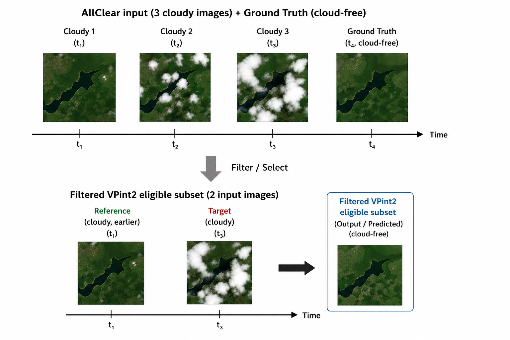

# Subset Filtering Methodology

## Why a subset?

Not all models in this benchmark are multi-temporal. VPint2 is a classical interpolation method that was not designed for time-series cloud removal. As noted by the VPint2 authors:

> "We note that our method was not intended to be used for time-series cloud removal, and could therefore only run on a subset of the test (SEN12MS-CR-TS) dataset." — Arp et al. (2024) [doi:10.1016/j.isprsjprs.2024.07.030](https://doi.org/10.1016/j.isprsjprs.2024.07.030)

To evaluate VPint2 on the AllClear dataset, samples were chosen that satisfied the same three conditions:

1. A **cloudy image** with at least one non-cloudy pixel to reconstruct
2. A **cloud-free reference image** available at a different timestep
3. A **cloud-free ground-truth image** for evaluation

With the temporal gap between the cloudy and ground-truth images kept as small as possible to minimize the chance of land changes (5 days set as default threshold).

## How the subset is selected

The filtering is implemented in `vpint2_filter.py` and produces two output files:

- `setup/vpint2_pairs.json` - maps each eligible AllClear ROI to its selected cloudy and reference indexes within the 3-image input
- `setup/vpint2_samples.json` - a filtered version of the AllClear ROI metadata JSON restricted to eligible samples

For each 3-frame AllClear sample, the script:

1. Computes cloud and shadow coverage per frame using the cloud/shadow masks
2. Selects the **most cloudy frame** as the target (above a minimum cloud threshold)
3. Selects the **least cloudy frame** as the reference (below a maximum cloud threshold)
4. Skips samples where no valid pair can be found

This yields a subset of 415 samples from the full AllClear test set on which VPint2 can run. All other models (LeastCloudy, Mosaicing, UnCRtainTS, EMRDM) are also evaluated on this same subset to ensure a fair comparison.
